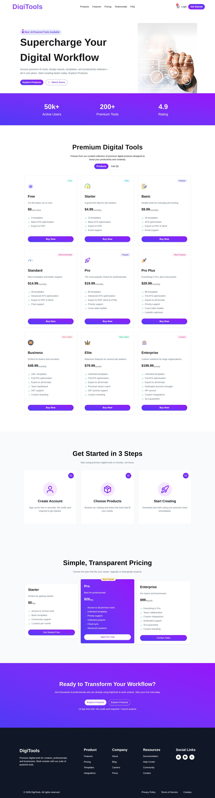

# DigiTools

DigiTools is a React-based web application that provides premium digital tools to help professionals supercharge their workflow. It offers AI-powered features, multiple subscription plans, and an intuitive interface for easy access to various tools.

## Screenshot



## Technologies Used

- React
- Vite
- Tailwind CSS
- DaisyUI
- React Icons
- React Toastify

## Features

- AI-powered digital tools for workflow enhancement
- Multiple subscription plans (Free, Starter, Basic, etc.)
- Interactive plan selection with cart functionality
- Step-by-step getting started guide
- Responsive design for all devices
- Toast notifications for user feedback

## Dependencies

### Production Dependencies
- @tailwindcss/vite: ^4.2.2
- react: ^19.2.4
- react-dom: ^19.2.4
- react-icons: ^5.6.0
- react-toastify: ^11.0.5
- tailwindcss: ^4.2.2

### Development Dependencies
- @eslint/js: ^9.39.4
- @types/react: ^19.2.14
- @types/react-dom: ^19.2.3
- @vitejs/plugin-react: ^6.0.1
- daisyui: ^5.5.19
- eslint: ^9.39.4
- eslint-plugin-react-hooks: ^7.0.1
- eslint-plugin-react-refresh: ^0.5.2
- globals: ^17.4.0
- vite: ^8.0.1

## Run Locally

Follow these steps to run the project on your local machine:

1. Clone the repository:
   ```
   git clone <repository-url>
   ```

2. Navigate to the project directory:
   ```
   cd B13-A6-code
   ```

3. Install dependencies:
   ```
   npm install
   ```

4. Start the development server:
   ```
   npm run dev
   ```

5. Open your browser and visit `http://localhost:5173` (or the port shown in the terminal).

## Links

- Live Demo: https://digi-tools-test.netlify.app/
- GitHub Repository: https://github.com/ShafayatSadid/B13-A6-code